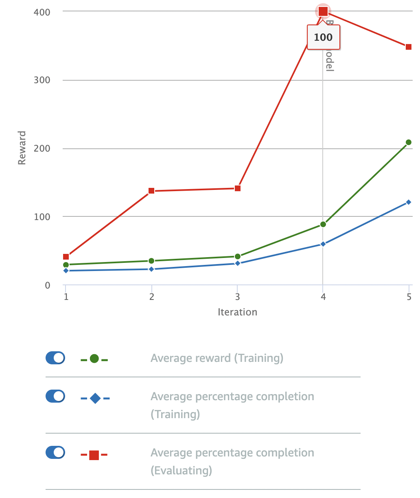

# Don't Wiggle

This model updates the "follow the line" model by penalizing oversteer, to try and reduce "wiggle" as the car drives around the track

## Reward Function

Again, the reward function is more or less straight out of the AWS documentation (there is an example function that tries to avoid oversteer):

```python
def reward_function(params):
    '''
    Example of penalize steering, which helps mitigate zig-zag behaviors
    '''
    
    # Read input parameters
    distance_from_center = params['distance_from_center']
    track_width = params['track_width']
    abs_steering = abs(params['steering_angle']) # Only need the absolute steering angle

    # Calculate 3 marks that are farther and father away from the center line
    marker_1 = 0.1 * track_width
    marker_2 = 0.25 * track_width
    marker_3 = 0.5 * track_width

    # Give higher reward if the car is closer to center line and vice versa
    if distance_from_center <= marker_1:
        reward = 1.0
    elif distance_from_center <= marker_2:
        reward = 0.5
    elif distance_from_center <= marker_3:
        reward = 0.1
    else:
        reward = 1e-3  # likely crashed/ close to off track

    # Steering penality threshold, change the number based on your action space setting
    ABS_STEERING_THRESHOLD = 15 

    # Penalize reward if the car is steering too much
    if abs_steering > ABS_STEERING_THRESHOLD:
        reward *= 0.8

    return float(reward)
```

## Parameters

I stuck to the default parameters for the model: 

| Hyperparameter | Value |
|----------------|-------|
| Gradient descent batch size | 64 | 
| Entropy | 0.01 |
| Discount Factor | 0.999 | 
| Loss Type | Huber |
| Learning Rate | 0.0003 | 
| Number of experience episodes between each policy-updating iteration | 20 |
| Number of epochs | 10 |

The training configuration was:

| Setting | Value |
|---------|-------|
| Race type | Time trial |
| Environment Simulation | Jennens Family Speedway |
| Sensor(s) | Camera |
| Action space type | Continuous |
| Speed | [ 0.5 : 1 ] m/s |
| Steering angle | [ -30 : 30 ] ° |
| Framework | Tensorflow |
| Reinforcement learning algorithm | PPO |
| Training time | 1 hour |

## Observations

The model was trained for an hour. Like *Follow the line*, the model pretty quickly started making its way around the track quite successfully:



Like *Follow the line*, the model was still slow, because the reward function does not reward speed around the track in any way. 

One major **positive** is that this model **steers very smoothly, and therefore stays on the track very well**. In the evaluation videos I looked through, it never needed to be reset: it always made it all the way around the track!

It does this far, far better than the *Follow the line* model. I'm not entirely sure why: my best guess is that penalizing oversteer forces the car to begin steering into turns in the track earlier, which prevents the model from getting confused because the track remains in front of the camera. 
