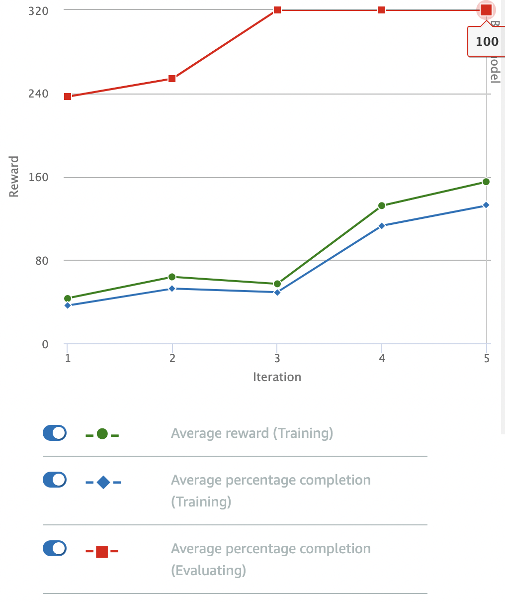

# Don't Wiggle, Fast

This model updates the "follow the line" model by penalizing oversteer, to try and reduce "wiggle" as the car drives around the track. **But this time, we also penalize speeds below 1 m/s**.

## Reward Function

```python
def reward_function(params):
    '''
    Example of penalize steering, which helps mitigate zig-zag behaviors
    '''
    
    # Read input parameters
    distance_from_center = params['distance_from_center']
    track_width = params['track_width']
    abs_steering = abs(params['steering_angle']) # Only need the absolute steering angle
    speed = params['speed']

    # Calculate 3 marks that are farther and father away from the center line
    marker_1 = 0.1 * track_width
    marker_2 = 0.25 * track_width
    marker_3 = 0.5 * track_width

    # Give higher reward if the car is closer to center line and vice versa
    if distance_from_center <= marker_1:
        reward = 1.0
    elif distance_from_center <= marker_2:
        reward = 0.5
    elif distance_from_center <= marker_3:
        reward = 0.1
    else:
        reward = 1e-3  # likely crashed/ close to off track

    # Steering penality threshold, change the number based on your action space setting
    ABS_STEERING_THRESHOLD = 15 

    # Penalize both oversteer and underspeed
    if abs_steering > ABS_STEERING_THRESHOLD and speed < 1.0:
        reward *= 0.6
    elif speed < 1.0:
        reward *= 0.8
    elif abs_steering > ABS_STEERING_THRESHOLD:
        reward *= 0.8

    return float(reward)
```

## Parameters

I stuck to the default parameters for the model: 

| Hyperparameter | Value |
|----------------|-------|
| Gradient descent batch size | 64 | 
| Entropy | 0.01 |
| Discount Factor | 0.999 | 
| Loss Type | Huber |
| Learning Rate | 0.0003 | 
| Number of experience episodes between each policy-updating iteration | 20 |
| Number of epochs | 10 |

The training configuration was:

| Setting | Value |
|---------|-------|
| Race type | Time trial |
| Environment Simulation | Jennens Family Speedway |
| Sensor(s) | Camera |
| Action space type | Continuous |
| Speed | [ 0.5 : 2 ] m/s |
| Steering angle | [ -30 : 30 ] ° |
| Framework | Tensorflow |
| Reinforcement learning algorithm | PPO |
| Training time | 1 hour |

## Observations

The model was trained for an hour, and was completing laps easily early on in the training process:



**This model is the fastest and most accurate so far**, in terms of its ability to stay on the track and complete a full lap with no resets. 

Penalizig lower speeds does seem to have led to some wiggle, though: the car is not maintaining its formerly smooth lines around the track. 

