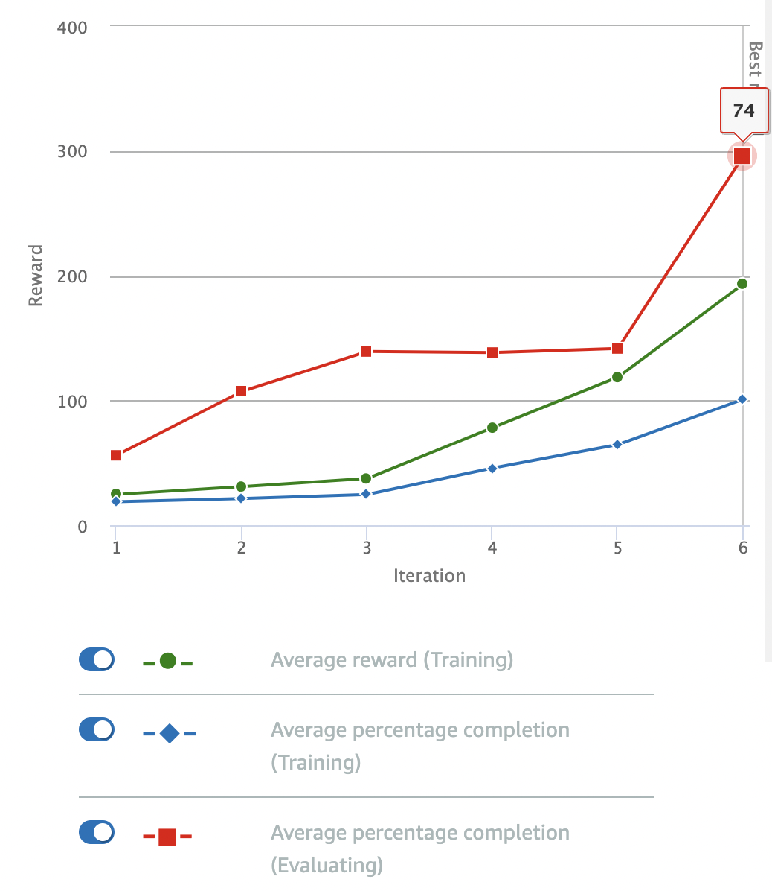

# Follow The Line

This is actually one of the default models provided by AWS, which I wanted to use as a reference point for comparisons against other models. 

## Reward Function

The reward function is pretty simple: basically, we reward the car for staying close to the center of the track:

```python
def reward_function(params):
    '''
    Example of rewarding the agent to follow center line
    '''
    
    # Read input parameters
    track_width = params['track_width']
    distance_from_center = params['distance_from_center']

    # Calculate 3 markers that are increasingly further away from the center line
    marker_1 = 0.1 * track_width
    marker_2 = 0.25 * track_width
    marker_3 = 0.5 * track_width

    # Give higher reward if the car is closer to center line and vice versa
    if distance_from_center <= marker_1:
        reward = 1.0
    elif distance_from_center <= marker_2:
        reward = 0.5
    elif distance_from_center <= marker_3:
        reward = 0.1
    else:
        reward = 1e-3  # likely crashed/ close to off track

    return reward
```

## Parameters

I stuck to the default parameters for the model: 

| Hyperparameter | Value |
|----------------|-------|
| Gradient descent batch size | 64 | 
| Entropy | 0.01 |
| Discount Factor | 0.999 | 
| Loss Type | Huber |
| Learning Rate | 0.0003 | 
| Number of experience episodes between each policy-updating iteration | 20 |
| Number of epochs | 10 |

The training configuration was:

| Setting | Value |
|---------|-------|
| Race type | Time trial |
| Environment Simulation | Jennens Family Speedway |
| Sensor(s) | Camera |
| Action space type | Continuous |
| Speed | [ 0.5 : 1 ] m/s |
| Steering angle | [ -30 : 30 ] ° |
| Framework | Tensorflow |
| Reinforcement learning algorithm | PPO |
| Training time | 1 hour |

## Observations

The model was trained for an hour. Despite the short training period, the model showed impressively fast convergence:



There were a couple of issues, though:

1. The model is slow: getting around the track took more than a minute
2. The model doesn't care enough about going off-track: on reviewing the evaluation video, the model goes off-track more than it should (this matters because real world DeepRacer competitions typically include a penalty for going off-track)
3. Unsteady steering: the car "wiggles" noticeably as it makes its way around the track