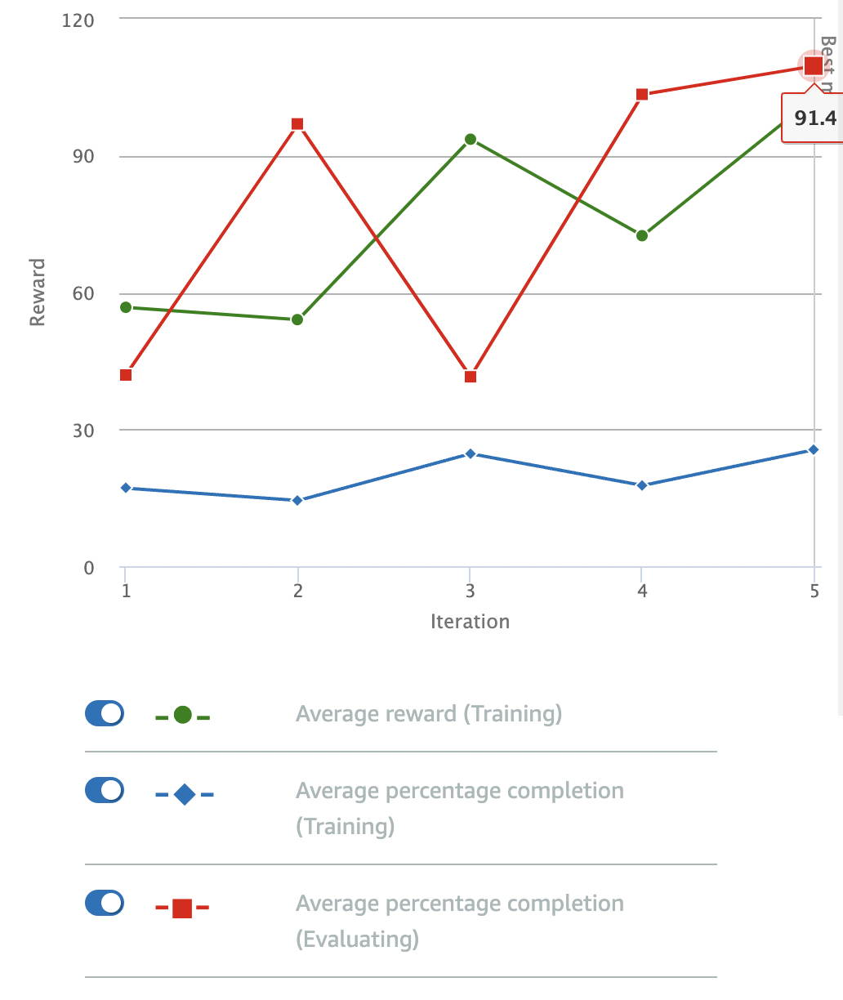

# Follow The Line (Fast)

A slightly modified line follower, that penalizes low speeds.

## Reward Function

```python
def reward_function(params):
    '''
    Example of rewarding the agent to follow center line
    '''
    
    # Read input parameters
    track_width = params['track_width']
    distance_from_center = params['distance_from_center']
    speed = params['speed']

    # Calculate 3 markers that are increasingly further away from the center line
    marker_1 = 0.1 * track_width
    marker_2 = 0.25 * track_width
    marker_3 = 0.5 * track_width

    # Give higher reward if the car is closer to center line and vice versa
    if distance_from_center <= marker_1:
        reward = 1.0
    elif distance_from_center <= marker_2:
        reward = 0.5
    elif distance_from_center <= marker_3:
        reward = 0.1
    else:
        reward = 1e-3  # likely crashed/ close to off track

    # Reduce reward if car is driving too slow
    if speed < 1.0:
        reward = reward * 0.8

    return reward
```

## Parameters

I stuck to the default parameters for the model: 

| Hyperparameter | Value |
|----------------|-------|
| Gradient descent batch size | 64 | 
| Entropy | 0.01 |
| Discount Factor | 0.999 | 
| Loss Type | Huber |
| Learning Rate | 0.0003 | 
| Number of experience episodes between each policy-updating iteration | 20 |
| Number of epochs | 10 |

The training cofiguration was:

| Setting | Value |
|---------|-------|
| Race type | Time trial |
| Environment Simulation | Jennens Family Speedway |
| Sensor(s) | Camera |
| Action space type | Continuous |
| Speed | [ 0.5 : 2 ] m/s |
| Steering angle | [ -30 : 30 ] ° |
| Framework | Tensorflow |
| Reinforcement learning algorithm | PPO |
| Training time | 1 hour |

## Observations

The model was trained for an hour. The speed penalty seemed to have a negative effect on the model's ability to optimize for higher rewards, but it still looks to be converging on a solution:



The model still exhibits the same issues as encountered with the original centerline follower: the car "wobbles" and has a tendency to go off-track. 

