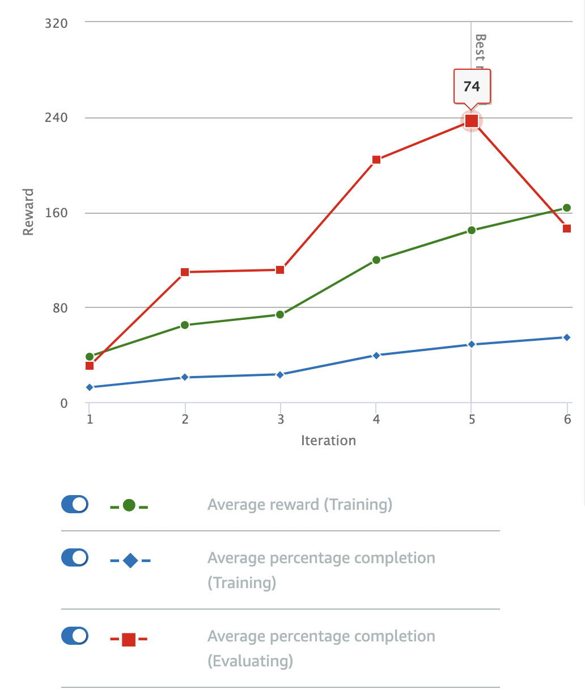

# Stay On Track

This model takes a new approach: if we're reasonably close to the center of the track **and** all our wheels are still on the track, we just give a reward of 1. That's it. 

## Reward Function

Again, the reward function is more or less straight out of the AWS documentation (they have an example function that just keeps its wheels on the track):

```python
def reward_function(params):
    '''
    Example of rewarding the agent to stay inside the two borders of the track
    '''
    
    # Read input parameters
    all_wheels_on_track = params['all_wheels_on_track']
    distance_from_center = params['distance_from_center']
    track_width = params['track_width']
    
    # Give a very low reward by default
    reward = 1e-3

    # Give a high reward if no wheels go off the track and 
    # the car is somewhere in between the track borders 
    if all_wheels_on_track and (0.5*track_width - distance_from_center) >= 0.05:
        reward = 1.0

    # Always return a float value
    return reward
```

## Parameters

I stuck to the default parameters for the model: 

| Hyperparameter | Value |
|----------------|-------|
| Gradient descent batch size | 64 | 
| Entropy | 0.01 |
| Discount Factor | 0.999 | 
| Loss Type | Huber |
| Learning Rate | 0.0003 | 
| Number of experience episodes between each policy-updating iteration | 20 |
| Number of epochs | 10 |

The training cofiguration was:

| Setting | Value |
|---------|-------|
| Race type | Time trial |
| Environment Simulation | Jennens Family Speedway |
| Sensor(s) | Camera |
| Action space type | Continuous |
| Speed | [ 0.5 : 1 ] m/s |
| Steering angle | [ -30 : 30 ] ° |
| Framework | Tensorflow |
| Reinforcement learning algorithm | PPO |
| Training time | 1 hour |

## Observations

The model was trained for an hour. It didn't show immediate signs of smooth convergence, unlike other models which reward the car based on distance to the centerline:



This model didn't immediately look promising. There were a couple issues:

1. Lots of going off track (2-3 resets per completion of the track)
2. Wiggly steering
3. Lots of wide, ungainly turns where the car stuck to the *outside* of a turn rather than keeping to the center or hugging the inside curve

The most interesting feature here was that the reward value was continuing to *increase* even as the model's ability to complete more of the track during training (blue line) seemed to be trending upwards only very slowly. Perhaps the reward function should explicitly give out larger rewards as the car manages to make it farther around the track before each crash/off-track event? 
