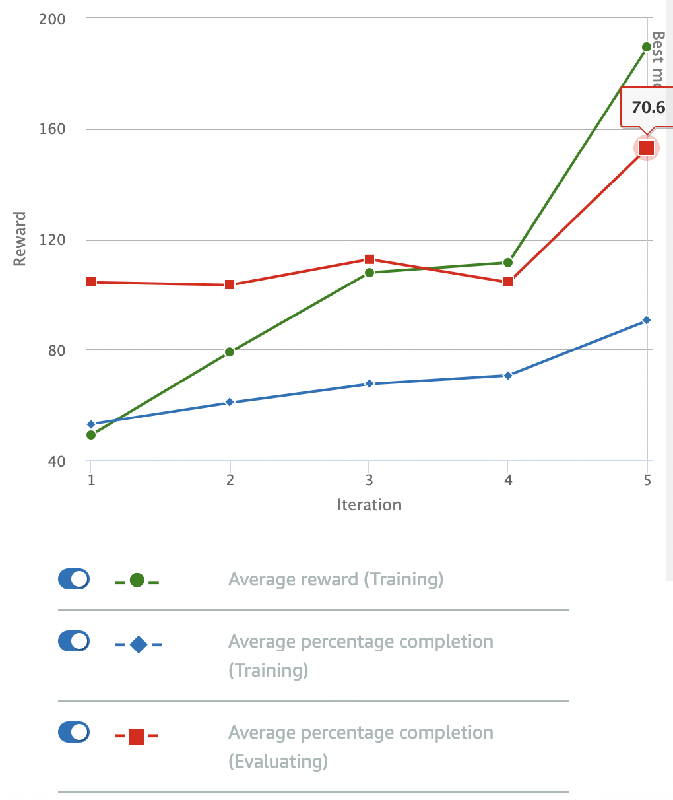

# Stay On Track, Fast

Stay on the track, but try to go faster (achieved by penalizing the car for slow speeds...see the reward function code below).

## Reward Function

```python
def reward_function(params):
    '''
    Example of rewarding the agent to stay inside the two borders of the track
    '''
    
    # Read input parameters
    all_wheels_on_track = params['all_wheels_on_track']
    distance_from_center = params['distance_from_center']
    track_width = params['track_width']
    speed = params['speed']
    
    # Give a very low reward by default
    reward = 1e-3

    # Give a high reward if no wheels go off the track and 
    # the car is somewhere in between the track borders 
    if all_wheels_on_track and (0.5*track_width - distance_from_center) >= 0.05:
        reward = 1.0

    # Reduce reward if car is driving too slow
    if speed < 1.0:
        reward = reward * 0.8

    # Always return a float value
    return reward
```

## Parameters

I stuck to the default parameters for the model: 

| Hyperparameter | Value |
|----------------|-------|
| Gradient descent batch size | 64 | 
| Entropy | 0.01 |
| Discount Factor | 0.999 | 
| Loss Type | Huber |
| Learning Rate | 0.0003 | 
| Number of experience episodes between each policy-updating iteration | 20 |
| Number of epochs | 10 |

The training configuration was:

| Setting | Value |
|---------|-------|
| Race type | Time trial |
| Environment Simulation | Jennens Family Speedway |
| Sensor(s) | Camera |
| Action space type | Continuous |
| Speed | [ 0.5 : 2 ] m/s |
| Steering angle | [ -30 : 30 ] ° |
| Framework | Tensorflow |
| Reinforcement learning algorithm | PPO |
| Training time | 1 hour |

## Observations

The model was trained for an hour. It showed definite improvement over the original *Stay on track* model. Perhaps these simpler reward functions really do just need more time to train?



This model still didn't do a good job driving straight down the track, but it *was* faster and it seemed to go off-track less than the original *Stay on track* model. Progress?